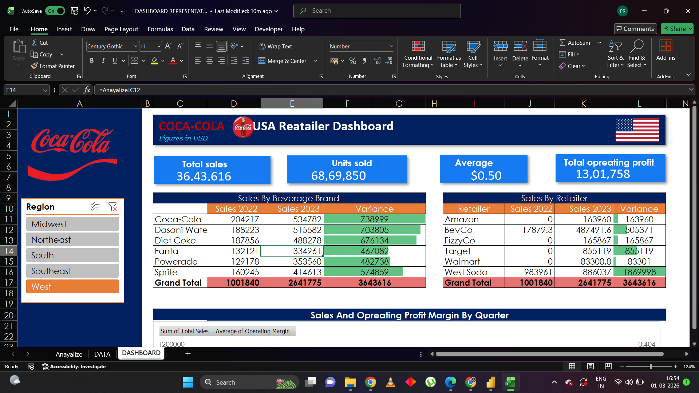

# Coca-Cola USA Sales Performance Analysis (2022-2023)

## 📌 Project Overview
An in-depth analysis of Coca-Cola's regional sales performance and retailer trends. This project uses Excel-based dashboards to visualize growth metrics and identify key revenue drivers across the United States.

## 📊 Key Insights & Results
* [cite_start]**Revenue Growth:** Fiscal year earnings reached **$43.493 billion** in 2023, reflecting an **8.39% increase** year-over-year.
* **Brand Performance:** Analyzed sales across major brands including Coca-Cola, Dasani, Diet Coke, Fanta, Powerade, and Sprite.
* [cite_start]**Retailer Impact:** Evaluated performance across key retailers such as Amazon, BevCo, and FizzyCo to identify market preferences[cite: 7].
* [cite_start]**Daily Engagement:** Coca-Cola products are enjoyed over **1.7 billion times daily** worldwide[cite: 5].

## 🛠️ Tools Used
* **Excel:** Data cleaning, Pivot Tables, and Dashboard design.
* [cite_start]**PowerPoint:** Stakeholder presentation and data storytelling.
* **Data Analysis:** Trend analysis, YoY growth calculation, and regional benchmarking.

## 📷 Dashboard Preview

